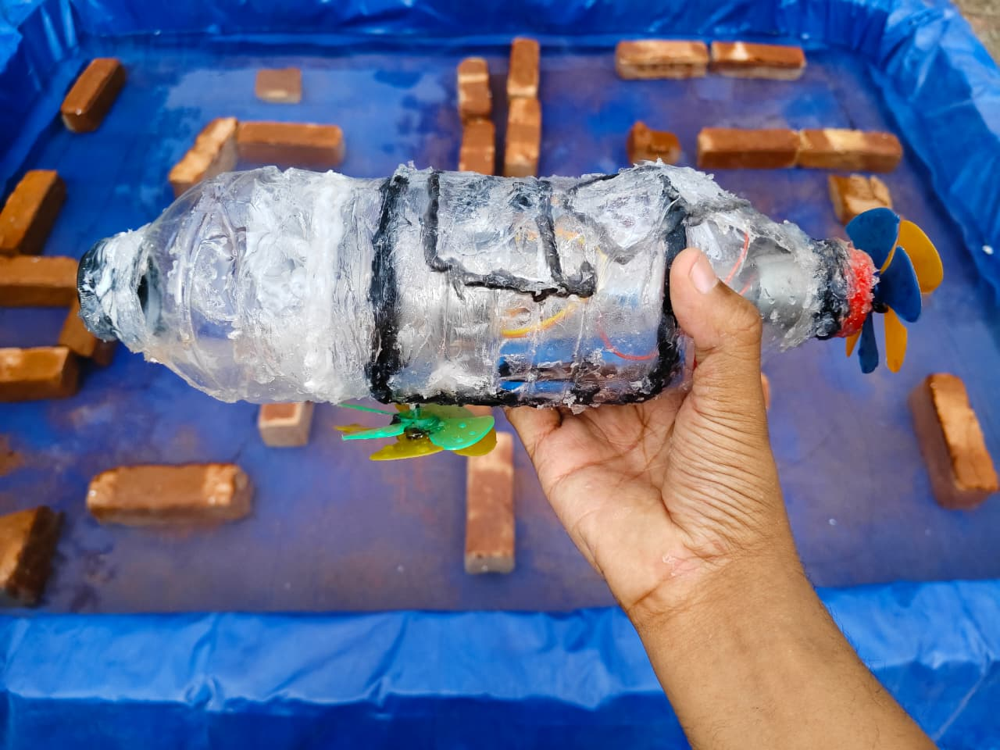
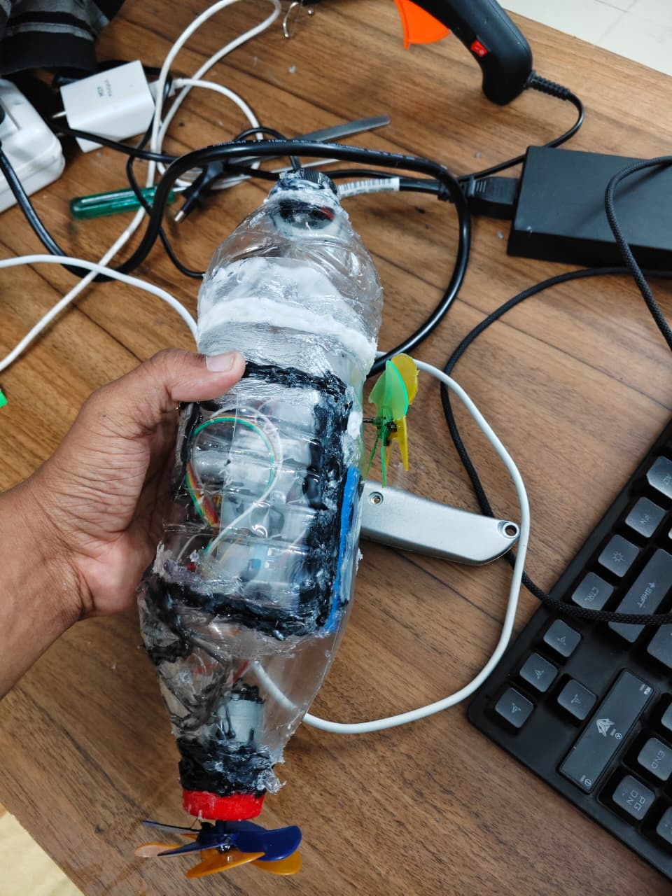
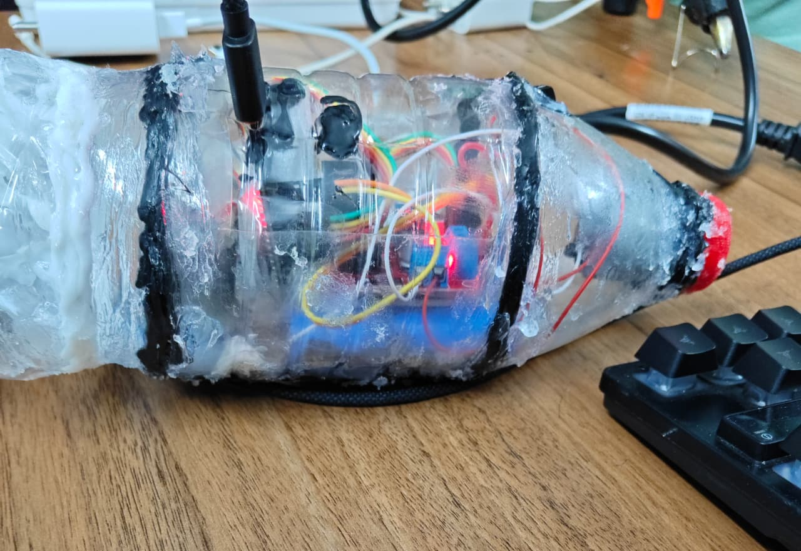

## 🚤 ESP32 WiFi Submarine Controller
A self-contained WiFi-controlled underwater vehicle powered by ESP32, featuring a real-time web control interface and dual-motor propulsion.

This project is a WiFi-controlled submarine (or underwater rover) powered by an ESP32.  
It creates its own wireless access point and hosts a web interface that allows real-time control of two DC motors for movement and steering.

The system is designed to be simple, responsive, and fully self-contained — no external app or internet connection required.

---

### 📸 Project Images

   

## 🎥 Demo Video

[▶️ Watch Demo](2.mp4)

---

### 🧠 How It Works

- The ESP32 acts as a WiFi Access Point
- A built-in web server serves a control dashboard
- User inputs (buttons & speed values) are sent via HTTP requests
- The ESP32 processes these requests and controls motors through a driver (e.g. L298N)

---

### ⚡ Key Features

- 📡 Standalone WiFi control (no router needed)
- 🎮 Web-based control interface (phone/PC compatible)
- 🔁 Forward, backward, left, right movement
- 🎚️ Adjustable motor speeds (PWM control)
- 🛑 Independent and full stop functions
- ⚙️ Lightweight and easy to modify

---

### 🔌 Hardware Required

- ESP32
- L298N (or similar motor driver)
- 2x DC motors
- Battery pack
- Waterproof enclosure

---

### 🔌 Wiring

ESP32 Pin to Motor Driver
33-ENA,
25-IN1,
26-IN2,
32-ENB,
27-IN3,
14-IN4

---

### 🚀 Getting Started

- Upload the code to your ESP32
- Power the board
- Connect to WiFi:
- SSID: Submarine
- Password: 12345678
- Open your browser and go to:
  http://192.168.4.1
- Use the interface to control the submarine

## 💻 Code

Main ESP32 Code:  
[View Code](code/main.ino)

---

### 🧪 Use Cases

- DIY underwater vehicles
- Robotics experiments
- Remote-controlled vehicles
- Educational projects (IoT + embedded systems)

---

### 🚧 Limitations

- Uses basic HTTP (no real-time streaming)
- No feedback sensors (depth, orientation, etc.)
- PWM via `analogWrite()` (can be improved with ESP32 LEDC)

---

### 🔮 Future Improvements

- WebSocket-based real-time control
- Camera streaming (ESP32-CAM)
- Depth/pressure sensor integration
- Battery monitoring system
- Waterproof enclosure design
