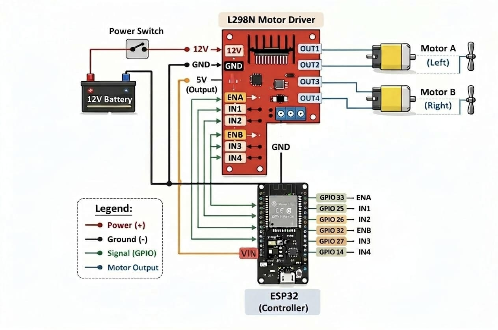

### 📄 Circuit Diagram & Connections

### 🔧 Components Used

- ESP32 Development Board
- L298N Motor Driver Module
- 2 × DC Motors (for propellers)
- Battery (7.4V–12V recommended)
- Connecting Wires

### 🔌 Circuit Diagram

  

### ⚡ Power Connections

- Battery positive (+) → L298N 12V
- Battery negative (−) → L298N GND
- L298N GND → ESP32 GND (common ground)
- L298N 5V → ESP32 5V/VIN

### 🔄 Motor Connections

- Motor A
  - Connected to OUT1 and OUT2
- Motor B
  - Connected to OUT3 and OUT4

### 🎮 Control Pins (ESP32 ↔ L298N)

L298N Pin to ESP32 Pin: ENA-33, IN1-25, IN2-26, ENB-32, IN3-27, IN4-14
